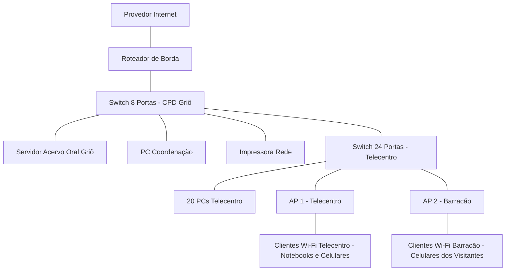

# Trilha guiada — Entrega D0: projeto inicial da rede
## Vozes do Quilombo - Rede da Casa Griô

### Identificação
| Campo | Resposta da equipe |
| --- | --- |
| Nome da equipe | Equipe Tambor Digital |
| Integrantes | Maria do Carmo Barboza |
| Turma | Técnico em Informática - Módulo 2 |
| Nome do projeto | Vozes do Quilombo - Rede da Casa Griô |
| Data | 17 de julho de 2026 |

### 1. Missão
Utilizaremos o cenário adaptado: Casa Griô de Cultura e Biblioteca Ancestral Quilombola, com foco no Acervo Digital de Histórias Orais e Cantigas de Capoeira do Território de Itapecuru.

### 2. Visão Geral e Cenário Atual
A Casa Griô hoje utiliza um roteador simples que atende tudo junto, sem separação de rede, conforme cenário do professor.

### 3. Objetivos
| Tipo | Objetivo |
| --- | --- |
| Geral | Criar rede hierárquica, segura e estável para guardar e divulgar histórias orais |
| Específico 1 | Organizar cabeamento com dois switches em cascata e garantir 1 Gbps no telecentro |
| Específico 2 | Garantir cobertura Wi-Fi com 2 APs para Telecentro e Barracão |
| Específico 3 | Garantir que o Servidor do Acervo tenha IP fixo interno |
| Específico 4 | Deixar rede pronta para oficinas com 20 PCs simultâneos |

### 4. Requisitos Técnicos
| Requisito | Descrição | Prioridade |
| --- | --- | --- |
| Desempenho | Rede cabeada Gigabit | Alta |
| Segurança | Isolamento futuro entre Coordenação e Visitantes | Alta |
| Distância | Nenhum lance >90m | Alta |
| Energia | Proteção elétrica - nobreak | Média - avaliar na D1 |

### Parte A — Compreensão do problema

#### 5. Escreva o problema
Na Casa Griô, mestres, jovens, visitantes e coordenação precisam gravar, ouvir e compartilhar o Acervo Digital, além de fazer oficinas, mas a casa não possui cabeamento estruturado, internet confiável e divisão entre rede pública e privada, o que deixa o servidor instável e expõe os registros ancestrais.
> Premissa a validar: instabilidade e falta de divisão precisam ser confirmadas em visita técnica.

#### 6. Identificar os usuários
| Grupo | Qtd | O que fazer | Prioridade |
| --- | --- | --- | --- |
| Coordenação / TI | 2 | Cuidar do servidor e da rede | Alta |
| Mestres Griôs | 6 | Gravar áudios e vídeos pelo Wi-Fi | Alta |
| Visitantes | 35 | Consultar acervo no celular | Média |
| Jovens | 25 | Usar PCs do telecentro | Alta |

#### 7. Setores ou ambientes
| Setor | Usuários | Dispositivos | Necessidades |
| --- | --- | --- | --- |
| Coordenação | Coordenação | 1 PC, 1 Impressora | Acesso privado e impressão segura |
| Telecentro Griô | Jovens | 20 PCs cabeados | Conexão estável com servidor |
| Barracão Cultural | Visitantes e Mestres | Celulares e notebooks | Wi-Fi amplo |
| Sala Técnica / CPD | TI | Servidor, Switches, Roteador | Local fechado e ventilado |

#### 8. Lista de necessidades e serviços
| Usuário | Necessidade | Importância |
| --- | --- | --- |
| Todos | Ouvir o Acervo Oral | Alta |
| Coordenação | Imprimir | Alta |
| Telecentro e Wi-Fi | Usar internet externa | Alta |
| Visitantes | Usar celular | Média |
| Coordenação | Configurar rede | Alta |

**Nota sobre isolamento:** Para a D0, isolamento entre visitantes e rede interna é necessidade futura.

### Parte B — Proposta

#### 9. Selecione recursos e justifique
| Recurso | Qtd | Justificativa | Dúvida ou premissa |
| --- | --- | --- | --- |
| Switch 24 portas Gigabit | 1 | Concentra 20 PCs + 2 APs + 1 uplink | Premissa: Gigabit |
| Switch 8 portas Gigabit | 1 | Atende servidor, PC, impressora, roteador e uplink | Ligado por uplink no switch de 24 |
| Roteador de Borda | 1 | Fará o encaminhamento e NAT entre LAN e internet. A disponibilidade de firewall integrado precisa ser confirmada no datasheet | A confirmar |
| Ponto de Acesso Wi-Fi 6 | 2 | Um AP no Telecentro e um AP no Barracão | Alcance real com taipa? |
| Servidor Torre | 1 | Guarda o site e banco de áudios | IP fixo interno |
| Cabo UTP Cat6 | 1 caixa | Garante 1 Gbps estável | Distância <90m |

**Cálculo de portas com 2 APs:**
- Switch 24 portas: 20 PCs + 2 APs + 1 uplink = 23 usadas, sobra 1
- Switch 8 portas: 1 PC + 1 impressora + 1 servidor + 1 roteador + 1 uplink = 5 usadas, sobram 3
- Total: 32 - 28 = 4 livres

#### 10. Perguntas em aberto
| Tipo | Pergunta | Como confirmar? |
| --- | --- | --- |
| Pergunta | O provedor entrega fibra com ONT ou rádio? | Ver contrato |
| Premissa | O Acervo precisa ser visto de fora? | Conversar com mestres griôs |
| Pergunta | Os APs suportam 2 SSIDs com isolamento? | Ver datasheet |

### Parte C — Topologia inicial

#### 11. Desenhe a topologia

**Explicação da topologia:**
O tráfego entra e sai somente pelo Roteador de Borda ligado ao Provedor. O Switch de 8 portas na Sala Técnica é o ponto central da rede. O Servidor do Acervo Oral está conectado diretamente nele para facilitar a centralização e ter conexão Gigabit direta ao núcleo da LAN. O Switch de 24 portas do Telecentro é ligado em cascata no Switch de 8. Os clientes Wi-Fi entram na LAN através dos 2 APs ligados no Switch de 24 portas. Como mostra o diagrama, notebooks e celulares se conectam sem fio ao AP1 e AP2. Todo equipamento listado aparece no desenho.

#### 12. Checklist técnico da topologia
| Item verificado | Status | Correção |
| --- | --- | --- |
| Todos os recursos aparecem? | OK | AP1, AP2 e clientes Wi-Fi adicionados |
| Cálculo de portas confere? | OK | 28 usadas e 4 livres |
| Hierarquia correta? | OK | APs no switch de acesso |
| Mermaid fecha? | OK | Fechado |
| Clientes Wi-Fi representados? | OK | CLI1 e CLI2 ligados aos APs |

### Parte D — Detalhamento lógico

#### 13. Plano de endereçamento IP - Premissa inicial para D0
| Dispositivo ou Grupo | IP Sugerido - Premissa | Justificativa |
| --- | --- | --- |
| Roteador de Borda - LAN | 192.168.10.1 | Gateway da rede da Casa Griô |
| Switch 8 Portas - CPD | 192.168.10.2 | Gerenciamento, premissa de switch gerenciável |
| Switch 24 Portas - Telecentro | 192.168.10.3 | Gerenciamento |
| Servidor Acervo Oral | 192.168.10.10 fixo | IP fixo para facilitar acesso ao acervo |
| PC Coordenação | 192.168.10.11 fixo | Facilitar impressão e suporte |
| Impressora | 192.168.10.20 fixo | IP fixo para fila de impressão |
| AP 1 - Telecentro | 192.168.10.30 | Gerenciamento |
| AP 2 - Barracão | 192.168.10.31 | Gerenciamento |
| PCs Telecentro - DHCP | 192.168.10.100 a 150 | Distribuição automática |
| Celulares e notebooks - DHCP | 192.168.10.151 a 220 | Distribuição automática |

> Este endereçamento é premissa inicial para a D0 e será validado na D1. Máscara sugerida /24.

#### 14. Segurança e controle de acesso - Necessidade futura
| Medida | Situação na D0 | Como será na D1 |
| --- | --- | --- |
| Separação de visitantes e coordenação | Apenas necessidade futura, sem VLAN configurada | Estudar criação de 2 SSIDs ou VLANs após site survey |
| Senha do Wi-Fi | Premissa de senhas diferentes para Griô e Visitantes | Definir com coordenação |
| Acesso ao servidor | Acesso livre na LAN nesta D0 | Avaliar usuário e senha no servidor do acervo |
| Acesso físico ao CPD | Sala Técnica trancada | Confirmar se há porta com chave |

#### 15. Serviços de rede previstos
| Serviço | Onde roda - Premissa | Para quem serve |
| --- | --- | --- |
| Servidor Web do Acervo Oral | Servidor Torre 192.168.10.10 | Todos na LAN via navegador |
| DHCP | Roteador de Borda | PCs, celulares e notebooks |
| DNS local e NAT | Roteador de Borda | Saída para internet, NAT a confirmar |
| Impressão em rede | Impressora 192.168.10.20 | Coordenação e Telecentro |
| Compartilhamento de arquivos do acervo | Servidor Torre | Mestres e Jovens |

#### 16. Plano de testes de conectividade - Como vamos testar
| Teste | Como fazer | Resultado esperado |
| --- | --- | --- |
| Ping para gateway | ping 192.168.10.1 de um PC | Resposta <1ms na rede cabeada |
| Ping para servidor do acervo | ping 192.168.10.10 | Resposta OK e página do acervo abre |
| Acesso ao acervo | Abrir http://192.168.10.10 no navegador | Página com áudios dos griôs abre |
| Impressão | Mandar página teste do PC da coordenação | Impressora imprime |
| Internet | Abrir site público | Site abre via NAT do roteador |
| Wi-Fi Telecentro | Conectar celular no AP1 | Celular navega e vê acervo |
| Wi-Fi Barracão | Conectar celular no AP2 | Celular navega no Barracão |
| Cabo | Testar com testador de cabos | 8 vias OK e 1 Gbps |

#### 17. Orçamento estimado - Premissa para D0
| Item | Quantidade | Valor unitário estimado - Premissa | Observação |
| --- | --- | --- | --- |
| Switch 24 portas Gigabit | 1 | A pesquisar | Verificar se gerenciável |
| Switch 8 portas Gigabit | 1 | A pesquisar | Verificar se gerenciável |
| Roteador de Borda | 1 | A pesquisar | Confirmar firewall integrado no datasheet |
| AP Wi-Fi 6 | 2 | A pesquisar | Com suporte a 2 SSIDs |
| Servidor Torre | 1 | Já existe na Casa Griô - premissa | Reaproveitar se possível |
| Caixa Cabo Cat6 305m | 1 | A pesquisar | + conectores RJ45 e keystones |
| Rack pequeno + patch panel | 1 | A pesquisar | Premissa de que não existe |

> Valores serão levantados na D1 com pesquisa em lojas locais. Nobreak será orçado após levantamento elétrico da Sala Técnica.

### Parte E — Revisão

#### 18. Uso de IA
| Campo | Resposta |
| --- | --- |
| Ferramenta usada | ChatGPT |
| Prompt usado | Como organizar uma rede pequena com 2 switches para um telecentro com 20 PCs e 2 APs? |
| Sugestão aceita | Usar 2 switches em cascata separando telecentro e CPD |
| Sugestão rejeitada | Uso de OSPF e ACLs avançadas, rede pequena e estática |
| Como verificamos | Apostila de cabeamento e cenário do professor |
| Correção feita pela equipe | Portas recalculadas com 2 APs e texto com contexto quilombola |

#### 19. Justificativa final da proposta
O projeto Vozes do Quilombo atende a Casa Griô com uma rede hierárquica simples e segura, pensada para o contexto comunitário. A escolha de dois switches organiza o cabeamento: o de 8 portas fica no CPD junto ao servidor do acervo e o de 24 portas fica no telecentro. Dois pontos de acesso foram previstos porque um único AP não cobriria o Barracão e o Telecentro devido à distância e às paredes de taipa, que são premissas a validar. O servidor fica no switch central para facilitar a centralização e ter conexão Gigabit direta ao núcleo da LAN. O roteador faz o encaminhamento e NAT e terá seu firewall confirmado no datasheet. Decisões provisórias: 2 SSIDs, alcance dos APs e nobreak, que dependem de visita técnica.

#### 20. Riscos, limitações e premissas a validar
| Risco | Impacto | Como mitigar |
| --- | --- | --- |
| Paredes de taipa bloquearem Wi-Fi | Sinal fraco no Barracão | Site survey na D1 |
| Distância >90m | UTP não pode | Medir com trena |
| Falta de rack e nobreak | Equipamentos soltos | Confirmar no local e incluir na D1 |
| Provedor rádio e não fibra | Configuração diferente | Ver contrato |
| IP fixo do servidor | Se não fixar, cai acesso | Reservar IP na D1 |

#### 21. Checklist final de aceitação
| Critério | Atende? | Onde está |
| --- | --- | --- |
| Seção 5 - Problema | Sim | Seção 5 |
| Seção 6 - Usuários | Sim | Seção 6 |
| Seção 7 - Setores | Sim | Seção 7 |
| Seção 8 - Necessidades | Sim | Seção 8 |
| Seção 9 - Recursos e portas com 2 APs | Sim | Seção 9 - 28 usadas e 4 livres |
| Seção 10 - Perguntas | Sim | Seção 10 |
| Seção 11 - Topologia com 2 APs e clientes Wi-Fi | Sim | Seção 11 |
| Seção 12 - Checklist técnico | Sim | Seção 12 |
| Seção 13 a 17 - Parte D completa | Sim | Seções 13,14,15,16,17 adicionadas agora |
| Seção 19 - Justificativa | Sim | Seção 19 corrigida |
| Seção 20 - Riscos | Sim | Seção 20 |
| Seção 22 - Organização | Sim | Seção 22 |
| Seção 23 - Síntese | Sim | Seção 23 |

#### 22. Organização dos arquivos
| Campo | Resposta |
| --- | --- |
| Nome do arquivo | D0-equipe-tambor-digital-vozes-do-quilombo.md |
| Local de entrega | Pasta /docs no GitHub e Trilha_D0_Projeto_Inicial_da_Rede.md na raiz |
| Padrão | D0-equipe-nome-do-projeto.md |
| Versão | D0 - v7 final completa com 13 a 17 |

#### 23. Síntese final da equipe
| Campo | Resposta |
| --- | --- |
| Decisão principal | Manter servidor no switch de 8 portas do CPD e usar 2 APs com clientes Wi-Fi representados no diagrama |
| Maior dúvida restante | Como configurar separação entre visitantes e rede interna na próxima etapa |
| O que precisa ser validado | Medir distância do Barracão, site survey do Wi-Fi, confirmar rack e nobreak, confirmar firewall do roteador e se acervo deve ser acessado fora da Casa Griô |
