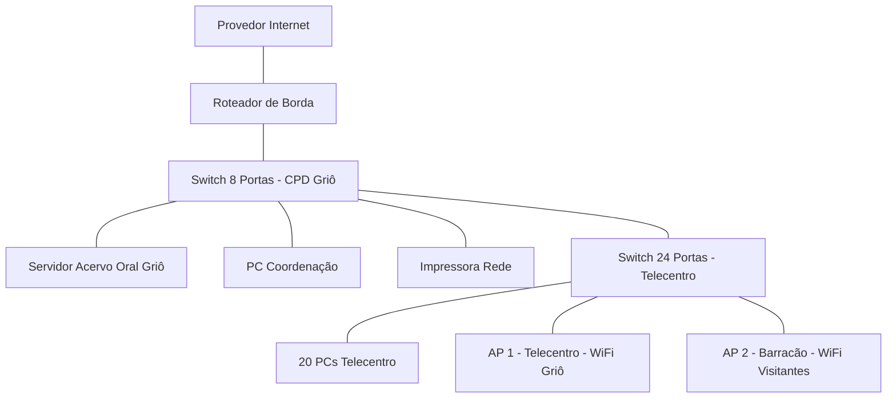

# Trilha guiada — Entrega do projeto inicial da rede
## Vozes do Quilombo - Rede da Casa Griô

### Identificação
| Campo | Resposta da equipe |
| --- | --- |
| Nome da equipe | Equipe Tambor Digital |
| Integrantes | Maria do Carmo Barboza |
| Turma | Técnico em Informática - Módulo 2 |
| Nome do projeto | Vozes do Quilombo - Rede da Casa Griô |
| Data | 17 de julho de 2026 |

### 1. Missão
**Cenário pela equipe**
Utilizaremos o cenário adaptado: Casa Griô de Cultura e Biblioteca Ancestral Quilombola, com foco em criar a infraestrutura para o funcionamento do Acervo Digital de Histórias Orais e Cantigas de Capoeira do Território de Itapecuru.

### 2. Visão Geral e Cenário Atual da Casa Griô
A Casa Griô de Cultura e Biblioteca Ancestral Quilombola fica no Território de Itapecuru. Hoje, conforme cenário fornecido pelo professor, a casa utiliza um roteador simples que atende tudo junto, sem separação de rede.

| Situação Atual | Problema Encontrado | Status da Informação |
| --- | --- | --- |
| Internet | Link único sem backup, sem firewall dedicado | Informação do cenário |
| Wi-Fi | Um único ponto de acesso aberto para todos, sem senha diferente para visitantes | Premissa a validar - precisa de levantamento |
| Cabeamento | Cabos sem organização, sem padrão Cat6 identificado | Premissa a validar - não consta no cenário se há rack e patch panel |
| Energia | Sem informação sobre nobreak para manter servidor ligado | Premissa a validar - será verificado na D1 |

### 3. Objetivos da Rede Vozes do Quilombo
| Tipo | Objetivo |
| --- | --- |
| Geral | Criar uma rede hierárquica, segura e estável para guardar e divulgar as histórias orais e cantigas de capoeira |
| Específico 1 | Organizar o cabeamento estruturado com dois switches em cascata e garantir 1 Gbps no telecentro |
| Específico 2 | Garantir cobertura Wi-Fi com 2 APs para atender Telecentro e Barracão Cultural, tratando separação de visitantes como necessidade futura |
| Específico 3 | Garantir que o Servidor do Acervo Oral tenha IP fixo interno e acesso rápido para mestres e jovens |
| Específico 4 | Deixar a rede pronta para oficinas de letramento digital com 20 PCs simultâneos |

### 4. Requisitos Técnicos e Restrições
| Requisito | Descrição | Prioridade | Observação D0 |
| --- | --- | --- | --- |
| Desempenho | Rede cabeada Gigabit para edição de áudios e vídeos do acervo | Alta | Atendido com switches Gigabit e cabo Cat6 |
| Segurança | Isolamento futuro entre Coordenação e Visitantes | Alta | Na D0 é apenas necessidade futura, sem VLAN configurada |
| Disponibilidade | Servidor do Acervo no ar mesmo com queda de internet | Alta | Servidor interno, acesso local garantido |
| Custo | Usar no máximo 2 switches, 2 APs e 1 caixa de cabo por ser projeto comunitário | Média | Dentro do escopo |
| Distância | Nenhum lance de cabo pode passar de 90 metros por limite do UTP | Alta | Premissa de que distância é menor que 90m, precisa medir |
| Manutenção | Rede simples que possa ser mantida pela própria coordenação | Alta | Topologia hierárquica simples |
| Energia | Proteção elétrica para equipamentos | Média | Nobreak fora do escopo desta D0, será avaliado na D1 após levantamento elétrico |

### Parte A — Compreensão do problema

#### 5. Escreva o problema
**Problema formulado pela equipe**
Na Casa Griô de Cultura e Biblioteca Ancestral, mestres griôs, jovens, visitantes e a coordenação precisam gravar, ouvir e compartilhar o Acervo Digital de Histórias Orais e Cantigas, além de fazer oficinas de letramento digital, mas a casa não possui cabeamento estruturado, internet confiável e divisão entre rede pública e privada, o que deixa o servidor do acervo instável, dificulta o trabalho da coordenação e expõe os registros ancestrais a acessos indevidos.

> Premissa a validar: a instabilidade e a falta de divisão são hipóteses baseadas no cenário fornecido e precisam ser confirmadas em visita técnica.

#### 6. Identificar os usuários
| Grupo de usuários | Quantidade estimada | O que fazer na rede | Prioridade |
| --- | --- | --- | --- |
| Coordenação / TI | 2 | Cuidar do servidor do acervo, da rede e dar suporte | Alta |
| Mestres Griôs / Oficineiros | 6 | Gravar áudios e vídeos e atualizar o acervo pelo Wi-Fi | Alta |
| Visitantes / Comunidade | 35 | Consultar o acervo oral e usar internet no celular | Média |
| Jovens do Território | 25 | Usar os computadores do telecentro para editar e estudar | Alta |

**Quem administrará ou manterá a rede?**
A manutenção será feita pela própria coordenação da Casa Griô, com apoio remoto do provedor quando houver falha no link.

#### 7. Identifique os setores ou ambientes
| Setor ou ambiente | Usuários | Dispositivos previstos | Necessidades principais |
| --- | --- | --- | --- |
| Coordenação | Coordenação | 1 PC, 1 Impressora | Acesso privado a arquivos e impressão segura |
| Telecentro Griô | Jovens | 20 PCs cabeados | Conexão estável com o Servidor do Acervo e internet |
| Barracão Cultural | Visitantes e Mestres | Celulares e notebooks | Wi-Fi amplo para consulta |
| Sala Técnica / CPD | TI | Servidor do Acervo, Switches, Roteador | Local fechado, ventilado e com energia protegida |

**Premissas a validar:** Paredes de taipa e palha que podem bloquear Wi-Fi, distância do Barracão até a Sala Técnica e existência de rack, patch panel e nobreak. Tudo será validado com site survey na próxima etapa.

#### 8. Lista de necessidades e serviços
| Usuário ou setor | Necessidade | Relacionado | Importância | Como saberemos que funciona? |
| --- | --- | --- | --- | --- |
| Todos | Ouvir o Acervo Oral | Servidor web interno | Alta | Abrir a página do acervo em qualquer dispositivo |
| Coordenação | Imprimir atividades | Impressão em rede | Alta | Mandar uma página teste para a impressora |
| Telecentro e Wi-Fi | Usar internet externa | NAT / Roteamento | Alta | Abrir um site público no navegador |
| Visitantes | Usar celular | Wi-Fi Visitantes | Média | Conectar celular para navegar |
| Coordenação | Configurar rede | SSH / HTTPS | Alta | Entrar na tela de configuração do switch |

**Nota sobre isolamento:** Para a D0, o isolamento entre visitantes e rede interna é tratado apenas como necessidade futura.

### Parte B — Proposta

#### 9. Selecione recursos e justifique
| Recurso | Quantidade | Necessidade atendida | Justificativa para a Casa Griô | Dúvida ou premissa |
| --- | --- | --- | --- | --- |
| Switch 24 portas Gigabit | 1 | Ligar PCs do Telecentro | Concentra os 20 PCs + 2 APs + 1 uplink em um único ponto | Premissa: Gigabit |
| Switch 8 portas Gigabit | 1 | Ligar CPD e Coordenação | Atende servidor, PC, impressora, roteador e uplink | Premissa: ligado por uplink no switch de 24 |
| Roteador de Borda | 1 | Ligar LAN com internet | Faz NAT e firewall básico | Pergunta: tem firewall integrado? |
| Ponto de Acesso Wi-Fi 6 | 2 | Wi-Fi para mestres e visitantes | Um AP no Telecentro e um AP no Barracão Cultural | Pergunta: alcance real com paredes de taipa? |
| Servidor Torre | 1 | Guardar Acervo Oral | Guarda o site e banco de áudios dos griôs | Premissa: IP fixo interno |
| Cabo UTP Cat6 | 1 caixa 305m | Cabeamento | Garante 1 Gbps estável | Premissa: distância <90m |

**Cálculo de portas corrigido (incluindo os 2 APs):**
- Switch 24 portas: 20 PCs + 2 APs + 1 uplink = 23 usadas, sobra 1.
- Switch 8 portas: 1 PC coordenação + 1 impressora + 1 servidor + 1 roteador + 1 uplink = 5 usadas, sobram 3.
- Total geral: 32 portas - 28 usadas = 4 livres para futuro.
- Quem usa Wi-Fi? Mestres Griôs, Jovens e Visitantes.
- Quantidade de APs é final? Não, é estimativa inicial para a D0, precisa de Site Survey.

**Sobre o nobreak:** Citado como problema potencial, mas não entra na lista desta D0 porque depende de levantamento elétrico. Registrado para avaliar na D1.

#### 10. Perguntas em aberto
| Tipo | Pergunta/Premissa | Por que importa? | Como confirmar? |
| --- | --- | --- | --- |
| Pergunta | O provedor entrega fibra com ONT ou rádio? | Define se precisa de conversor | Ver contrato do provedor |
| Premissa | O Acervo Oral precisa ser visto de fora da Casa Griô? | Define se precisa liberar porta externa | Conversar com os mestres griôs |
| Pergunta | Os APs suportam 2 SSIDs com isolamento? | Essencial para futura separação de visitantes | Ver datasheet dos APs |

### Parte C — Topologia inicial

#### 11. Desenhe a topologia

**Explicação da topologia:**
O tráfego entra e sai somente pelo Roteador de Borda ligado ao Provedor de Internet. O Switch de 8 portas na Sala Técnica / CPD é o ponto central da rede. O Servidor do Acervo Oral Griô está conectado diretamente nele para ter melhor desempenho. O Switch de 24 portas do Telecentro é ligado em cascata no Switch de 8 portas. Os clientes Wi-Fi entram na LAN através dos 2 APs ligados no Switch de 24 portas. AP 1 atende o Telecentro e AP 2 atende o Barracão Cultural. Todo equipamento listado nos recursos aparece no desenho.

#### 12. Checklist técnico da topologia
| Item verificado | Status | Correção feita |
| --- | --- | --- |
| Todos os recursos aparecem no desenho? | Corrigido | Adicionado AP2 no Barracão, antes havia apenas 1 AP |
| Cálculo de portas confere com topologia? | Corrigido | Recalculado para 28 usadas e 4 livres, incluindo 2 APs |
| Hierarquia de camadas está correta? | OK | APs ligados no switch de acesso, não direto no roteador |
| Bloco Mermaid fecha corretamente? | Corrigido | Fechado o bloco com três acentos graves e testado |
| Leitura do fluxo de tráfego está clara? | Corrigido | Adicionada explicação completa de entrada, ponto central e Wi-Fi |

### Parte E — Revisão

#### 18. Uso de IA
| Campo | Resposta |
| --- | --- |
| Ferramenta usada | ChatGPT |
| Prompt usado | Como organizar uma rede pequena com 2 switches para um telecentro com 20 PCs e 2 APs? |
| Sugestão aceita | Ideia de usar 2 switches em cascata separando telecentro e CPD para organizar cabeamento da Casa Griô |
| Sugestão rejeitada | Uso de OSPF e ACLs avançadas, pois a rede é pequena e estática e ainda estamos na D0. Deixamos como estudo futuro |
| Como verificamos | Conferimos com apostila de cabeamento estruturado do curso e com o cenário fornecido pelo professor |
| Correção feita pela equipe | Redistribuímos portas livres considerando 2 APs e reescrevemos justificativas com contexto quilombola da Casa Griô |

#### 19. Justificativa final da proposta
O projeto Vozes do Quilombo atende a Casa Griô com uma rede hierárquica simples e segura, pensada para o contexto comunitário. A escolha de dois switches organiza o cabeamento: o de 8 portas fica no CPD junto ao servidor do acervo e o de 24 portas fica no telecentro. Dois pontos de acesso foram previstos porque um único AP não cobriria o Barracão e o Telecentro devido à distância e às paredes de taipa, que são premissas a validar. O servidor fica no switch central para facilitar a centralização e ter conexão Gigabit direta ao núcleo da LAN. O roteador faz o encaminhamento e NAT e terá seu firewall confirmado no datasheet. Decisões ainda provisórias: necessidade real de 2 SSIDs, alcance exato dos APs e necessidade de nobreak.

#### 20. Riscos, limitações e premissas a validar
| Risco ou Limitação | Impacto na Casa Griô | Como vamos mitigar ou validar |
| --- | --- | --- |
| Paredes de taipa e palha bloquearem Wi-Fi | Sinal fraco no Barracão | Fazer site survey na D1 para confirmar alcance real dos 2 APs |
| Distância entre CPD e Barracão maior que 90m | Cabo UTP não pode passar disso | Medir distância real com trena na visita técnica |
| Falta de rack, patch panel e nobreak | Equipamentos soltos e sem proteção elétrica | Confirmar no local e incluir no orçamento da D1 se precisar |
| Provedor entregar rádio e não fibra | Precisa de configuração diferente no roteador | Ver contrato do provedor e modelo da ONT |
| Servidor do acervo com IP fixo | Se não fixar, cai o acesso | Configurar IP reservado no roteador na D1 |
| Separação de visitantes e rede interna | Sem separação, expõe acervo | Tratar como necessidade futura, estudar VLANs na D1 |

#### 21. Checklist final de aceitação
| Critério Obrigatório | Atende? | Onde está no documento |
| --- | --- | --- |
| Seção 5 - Problema escrito de forma clara? | Sim | Seção 5 com premissa a validar |
| Seção 6 - Usuários identificados com quantidade e prioridade? | Sim | Seção 6 com 4 grupos |
| Seção 7 - Setores ou ambientes descritos? | Sim | Seção 7 com 4 setores e premissas |
| Seção 8 - Necessidades e serviços listados? | Sim | Seção 8 com 5 necessidades |
| Seção 9 - Recursos justificados e cálculo de portas com 2 APs? | Sim | Seção 9 com 28 usadas e 4 livres |
| Seção 10 - Perguntas em aberto registradas? | Sim | Seção 10 com 3 itens |
| Seção 11 - Topologia desenhada com 2 APs e clientes Wi-Fi? | Sim | Seção 11 Mermaid com AP1, AP2 e clientes sem fio |
| Seção 12 - Checklist técnico da topologia preenchido? | Sim | Seção 12 com 5 itens corrigidos |
| Seção 19 - Justificativa final? | Sim | Seção 19 corrigida sem afirmar desempenho máximo |
| Seção 20 - Riscos e premissas? | Sim | Seção 20 acima |
| Seção 22 - Organização dos arquivos? | Sim | Seção 22 abaixo |
| Seção 23 - Síntese final da equipe? | Sim | Seção 23 abaixo |

#### 22. Organização dos arquivos
| Campo | Resposta |
| --- | --- |
| Nome do arquivo no repositório | D0-equipe-tambor-digital-vozes-do-quilombo.md |
| Local de entrega | Pasta /docs no GitHub da equipe e arquivo Trilha_D0_Projeto_Inicial_da_Rede.md na raiz |
| Padrão seguido | D0-equipe-nome-do-projeto.md conforme roteiro essencial |
| Link do repositório | A ser preenchido pela equipe após push |
| Versão | D0 - v5 final corrigida com seções 20, 21 e 22 |

#### 23. Síntese final da equipe
| Campo | Resposta |
| --- | --- |
| Decisão principal tomada | Manter servidor do Acervo Oral no switch de 8 portas do CPD e usar 2 APs, um para cada ambiente, com clientes Wi-Fi representados no diagrama |
| Maior dúvida restante | Como configurar a separação entre visitantes e rede interna na próxima etapa, já que na D0 tratamos apenas como necessidade futura |
| O que precisa ser validado na próxima etapa | Medir distância real do Barracão, fazer site survey do Wi-Fi, confirmar se há rack e nobreak, confirmar firewall do roteador e confirmar com mestres griôs se o acervo deve ser acessado fora da Casa Griô |
