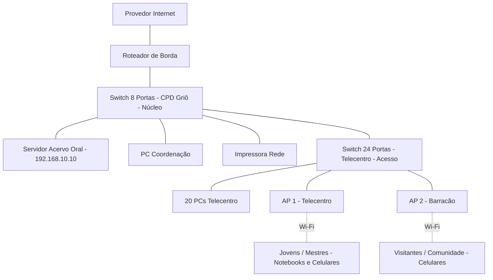

# Trilha guiada — Entrega D0: projeto inicial da rede
## Vozes do Quilombo - Rede da Casa Griô

### Identificação
| Campo | Resposta da equipe |
| --- | --- |
| Nome da equipe | Equipe Tambor Digital |
| Integrantes | Maria do Carmo Barboza |
| Turma | Técnico em Informática - Módulo 2 |
| Nome do projeto | Vozes do Quilombo - Rede da Casa Griô |
| Data | 17 de julho de 2026 |

### 1. Missão
Utilizaremos o cenário adaptado: Casa Griô de Cultura e Biblioteca Ancestral Quilombola, com foco em criar a infraestrutura para o funcionamento do Acervo Digital de Histórias Orais e Cantigas de Capoeira do Território de Itapecuru.

### 2. Visão Geral e Cenário Atual
A Casa Griô fica no Território de Itapecuru. Hoje utiliza um roteador simples que atende tudo junto, sem separação de rede, conforme cenário fornecido pelo professor.

### 3. Objetivos
| Tipo | Objetivo |
| --- | --- |
| Geral | Criar rede hierárquica, segura e estável para guardar e divulgar histórias orais |
| Específico 1 | Organizar cabeamento com dois switches em cascata e garantir 1 Gbps no telecentro |
| Específico 2 | Garantir cobertura Wi-Fi com 2 APs para Telecentro e Barracão |
| Específico 3 | Garantir que o Servidor do Acervo tenha IP estável |
| Específico 4 | Deixar rede pronta para oficinas com 20 PCs simultâneos |

### 4. Requisitos Técnicos e Restrições
| Requisito | Descrição | Prioridade | Observação D0 |
| --- | --- | --- | --- |
| Desempenho | Rede cabeada Gigabit | Alta | Switches Gigabit e cabo Cat6 |
| Segurança | Isolamento futuro entre Coordenação e Visitantes | Alta | Na D0 é necessidade futura, sem VLAN |
| Distância | Nenhum lance >90m | Alta | Premissa a medir |
| Energia | Proteção elétrica | Média | Nobreak fora do escopo D0, avaliar na D1 |

### Parte A — Compreensão do problema

#### 5. Escreva o problema
Na Casa Griô, mestres griôs, jovens, visitantes e coordenação precisam gravar, ouvir e compartilhar o Acervo Digital de Histórias Orais e Cantigas, além de fazer oficinas de letramento digital, mas a casa não possui cabeamento estruturado, internet confiável e divisão entre rede pública e privada, o que deixa o servidor instável, dificulta o trabalho da coordenação e expõe os registros ancestrais a acessos indevidos.
> Premissa a validar: instabilidade e falta de divisão precisam ser confirmadas em visita técnica.

#### 6. Identificar os usuários
| Grupo | Quantidade | O que fazer na rede | Prioridade |
| --- | --- | --- | --- |
| Coordenação / TI | 2 | Cuidar do servidor e da rede | Alta |
| Mestres Griôs / Oficineiros | 6 | Gravar áudios e vídeos pelo Wi-Fi | Alta |
| Visitantes / Comunidade | 35 | Consultar o acervo oral e usar internet no celular | Média |
| Jovens do Território | 25 | Usar os PCs do telecentro para editar e estudar | Alta |

**Quem administrará ou manterá a rede?**
A manutenção será feita pela própria coordenação da Casa Griô, com apoio remoto do provedor quando houver falha no link.

#### 7. Identifique os setores ou ambientes
| Setor | Usuários | Dispositivos previstos | Necessidades |
| --- | --- | --- | --- |
| Coordenação | Coordenação | 1 PC, 1 Impressora | Acesso privado e impressão segura |
| Telecentro Griô | Jovens | 20 PCs cabeados | Conexão estável com Servidor |
| Barracão Cultural | Visitantes e Mestres | Celulares e notebooks | Wi-Fi amplo para consulta |
| Sala Técnica / CPD | TI | Servidor, Switches, Roteador | Local fechado, ventilado e com energia protegida |

**Premissas a validar:** Paredes de taipa e palha que podem bloquear Wi-Fi, distância do Barracão até a Sala Técnica menor que 90m, existência de rack, patch panel e nobreak.

#### 8. Lista de necessidades e serviços
| Usuário | Necessidade | Relacionado | Importância | Como saberemos que funciona? |
| --- | --- | --- | --- | --- |
| Todos | Ouvir o Acervo Oral | Servidor web interno | Alta | Abrir página do acervo em qualquer dispositivo |
| Coordenação | Imprimir atividades | Impressão em rede | Alta | Mandar página teste para impressora |
| Telecentro e Wi-Fi | Usar internet externa | NAT / Roteamento | Alta | Abrir site público |
| Visitantes | Usar celular | Wi-Fi Visitantes | Média | Conectar celular para navegar |
| Coordenação | Configurar rede | SSH / HTTPS | Alta | Entrar na tela de configuração do switch |

**Nota sobre isolamento:** Para a D0, o isolamento entre visitantes e rede interna é tratado apenas como necessidade futura.

### Parte B — Proposta

#### 9. Selecione recursos e justifique
| Recurso | Quantidade | Necessidade atendida | Justificativa | Dúvida ou premissa |
| --- | --- | --- | --- | --- |
| Switch 24 portas Gigabit | 1 | Ligar PCs do Telecentro | Concentra 20 PCs + 2 APs + 1 uplink em um único ponto | Premissa: Gigabit. Limitação: restará apenas 1 porta livre neste switch |
| Switch 8 portas Gigabit | 1 | Ligar CPD e Coordenação | Atende servidor, PC, impressora, roteador e uplink | Ligado por uplink no switch de 24 |
| Roteador de Borda | 1 | Ligar LAN com internet | Realiza o encaminhamento/NAT; a existência de firewall integrado será confirmada no datasheet | A confirmar no datasheet |
| Ponto de Acesso Wi-Fi 6 | 2 | Wi-Fi para mestres e visitantes | Um AP no Telecentro e um AP no Barracão Cultural | Alcance real com paredes de taipa? |
| Servidor Torre | 1 | Guardar Acervo Oral | Guarda o site e banco de áudios dos griôs | Premissa: IP estável via reserva DHCP ou fixo |
| Cabo UTP Cat6 | 1 caixa 305m | Cabeamento | Garante 1 Gbps estável | Distância <90m |

**Cálculo de portas corrigido incluindo os 2 APs:**
- Switch 24 portas: 20 PCs + 2 APs + 1 uplink = 23 usadas, sobra 1 livre. A proposta atende a demanda inicial, mas deixa apenas uma porta livre no switch do Telecentro, devendo ser reavaliada caso haja expansão.
- Switch 8 portas: 1 PC coordenação + 1 impressora + 1 servidor + 1 roteador + 1 uplink = 5 usadas, sobram 3 livres.
- Total geral: 32 portas - 28 usadas = 4 livres para futuro.

**Sobre o nobreak:** Citado como problema potencial, mas não entra na lista desta D0 porque depende de levantamento elétrico da Sala Técnica. Registrado para avaliar na D1.

#### 10. Perguntas em aberto
| Tipo | Pergunta/Premissa | Por que importa? | Como confirmar? |
| --- | --- | --- | --- |
| Pergunta | O provedor entrega fibra com ONT ou rádio? | Define se precisa de conversor | Ver contrato do provedor |
| Premissa | O Acervo Oral precisa ser visto de fora da Casa Griô? | Define se precisa liberar porta externa | Conversar com mestres griôs |
| Pergunta | Os APs suportam 2 SSIDs com isolamento? | Essencial para futura separação de visitantes | Ver datasheet dos APs |

### Parte C — Topologia inicial

#### 11. Desenhe a topologia

**Qual é a tipologia inicial escolhida?**
Escolhemos uma topologia hierárquica em estrela estendida / cascata. 
- O Roteador de Borda fica no topo, ligado ao Provedor.
- O Switch de 8 portas do CPD é o núcleo/distribuição, onde fica o Servidor do Acervo.
- O Switch de 24 portas do Telecentro é o acesso, ligado em cascata no Switch de 8.
- Os 2 APs ficam na borda de acesso, ligados no Switch de 24, e os clientes Wi-Fi entram por eles.

Essa é a topologia inicial da D0 - ainda sem VLANs, ainda tudo na mesma rede, só organizada fisicamente.

**Desenho da topologia inicial com clientes Wi-Fi:**

**Explicação do fluxo de tráfego:**
O tráfego entra e sai somente pelo Roteador de Borda. O Switch de 8 portas na Sala Técnica é o ponto central. O Servidor do Acervo está nele para facilitar a centralização e ter conexão Gigabit direta ao núcleo da LAN. O Switch de 24 portas do Telecentro é ligado em cascata no Switch de 8. Os clientes Wi-Fi entram na LAN através dos 2 APs, como mostra a linha pontilhada Wi-Fi no diagrama. Todo equipamento aparece no desenho, incluindo os clientes sem fio WIFI1 e WIFI2.

#### 12. Checklist técnico da topologia
| Item verificado | Status Final | Correção feita |
| --- | --- | --- |
| Todos os recursos aparecem no desenho? | OK | AP1, AP2 e clientes WIFI1 e WIFI2 adicionados com ligação pontilhada Wi-Fi |
| Cálculo de portas confere com topologia? | OK | 28 usadas e 4 livres, incluindo 2 APs |
| Hierarquia de camadas está correta? | OK | APs ligados no switch de acesso, não direto no roteador |
| Bloco Mermaid fecha corretamente? | OK | Fechado com três acentos graves e testado |
| Leitura do fluxo de tráfego está clara? | OK | Explicação reescrita sem "melhor desempenho" ou "desempenho máximo" |
| Margem de expansão do switch 24? | Limitação registrada | Apenas 1 porta livre no Telecentro, registrado para reavaliação |

### Parte D — Detalhamento lógico

#### 13. Plano de endereçamento IP - Premissa inicial D0
| Dispositivo | IP Sugerido | Justificativa |
| --- | --- | --- |
| Roteador de Borda - LAN | 192.168.10.1 | Gateway da rede |
| Switch 8 Portas - CPD | 192.168.10.2 | Gerenciamento |
| Switch 24 Portas - Telecentro | 192.168.10.3 | Gerenciamento |
| Servidor Acervo Oral | 192.168.10.10 fixo | Sem endereço estável ou reserva DHCP, o endereço do servidor pode mudar e dificultar o acesso dos clientes |
| PC Coordenação | 192.168.10.11 fixo | Facilitar impressão |
| Impressora | 192.168.10.20 fixo | Sem endereço estável ou reserva DHCP, o endereço pode mudar e dificultar o acesso |
| AP 1 - Telecentro | 192.168.10.30 | Gerenciamento |
| AP 2 - Barracão | 192.168.10.31 | Gerenciamento |
| PCs Telecentro - DHCP | 192.168.10.100 a 150 | Automático |
| Celulares e notebooks - DHCP | 192.168.10.151 a 220 | Automático |

> Este endereçamento é premissa inicial para a D0 e será validado na D1. Máscara sugerida /24.

#### 14. Segurança e controle de acesso - Necessidade futura
| Medida | Situação na D0 | Como será na D1 |
| --- | --- | --- |
| Separação de visitantes e coordenação | Apenas necessidade futura, sem VLAN configurada | Estudar 2 SSIDs ou VLANs após site survey |
| Senha do Wi-Fi | Premissa de senhas diferentes para Griô e Visitantes | Definir com coordenação |
| Acesso ao servidor | Acesso livre na LAN nesta D0 | Avaliar usuário e senha |

#### 15. Serviços de rede previstos
| Serviço | Onde roda - Premissa | Para quem serve |
| --- | --- | --- |
| Servidor Web do Acervo Oral | Servidor Torre 192.168.10.10 | Todos na LAN via navegador |
| DHCP | Roteador de Borda | PCs, celulares e notebooks |
| NAT / Encaminhamento | Roteador de Borda | Saída para internet |
| Impressão em rede | Impressora 192.168.10.20 | Coordenação |

#### 16. Plano de testes de conectividade
| Teste | Como fazer | Resultado esperado |
| --- | --- | --- |
| Ping para gateway | ping 192.168.10.1 | Resposta <1ms |
| Ping para servidor | ping 192.168.10.10 | Resposta OK |
| Acesso ao acervo | Abrir http://192.168.10.10 | Página com áudios abre |
| Impressão | Mandar página teste | Impressora imprime |
| Internet | Abrir site público | Site abre via NAT |
| Wi-Fi Telecentro | Conectar celular no AP1 | Celular navega e vê acervo |
| Wi-Fi Barracão | Conectar celular no AP2 | Celular navega no Barracão |
| Cabo | Testar com testador | 8 vias OK e 1 Gbps |

#### 17. Orçamento estimado - Premissa D0
| Item | Quantidade | Observação |
| --- | --- | --- |
| Switch 24 portas Gigabit | 1 | Verificar se gerenciável |
| Switch 8 portas Gigabit | 1 | Verificar se gerenciável |
| Roteador de Borda | 1 | Confirmar firewall integrado no datasheet |
| AP Wi-Fi 6 | 2 | Com suporte a 2 SSIDs |
| Servidor Torre | 1 | Já existe na Casa Griô - premissa |
| Caixa Cabo Cat6 305m | 1 | + conectores RJ45 |
| Rack + patch panel | 1 | Premissa de que não existe |

> Valores serão levantados na D1. Nobreak será orçado após levantamento elétrico.

### Parte E — Revisão

#### 18. Uso de IA
| Campo | Resposta |
| --- | --- |
| Ferramenta usada | ChatGPT |
| Prompt usado | Como organizar uma rede pequena com 2 switches para um telecentro com 20 PCs e 2 APs? |
| Sugestão aceita | Ideia de usar 2 switches em cascata separando telecentro e CPD para organizar cabeamento da Casa Griô |
| Sugestão rejeitada | Uso de OSPF e ACLs avançadas, pois a rede é pequena e estática e ainda estamos na D0. Deixamos como estudo futuro |
| Como verificamos | Conferimos com apostila de cabeamento estruturado do curso e com o cenário fornecido pelo professor |
| Correção feita pela equipe | Redistribuímos portas livres considerando 2 APs, adicionamos clientes Wi-Fi no diagrama com ligação pontilhada e reescrevemos justificativas sem usar "desempenho máximo" |

#### 19. Justificativa final da proposta
O projeto Vozes do Quilombo atende a Casa Griô com uma rede hierárquica simples e segura, pensada para o contexto comunitário. A escolha de dois switches organiza o cabeamento: o de 8 portas fica no CPD junto ao servidor do acervo e o de 24 portas fica no telecentro. Dois pontos de acesso foram previstos porque um único AP não cobriria o Barracão e o Telecentro devido à distância e às paredes de taipa, que são premissas a validar. O servidor fica no switch central para facilitar a centralização e ter conexão Gigabit direta ao núcleo da LAN. O roteador realiza o encaminhamento/NAT; a existência de firewall integrado será confirmada no datasheet. A proposta atende a demanda inicial, mas deixa apenas uma porta livre no switch do Telecentro, devendo ser reavaliada caso haja expansão. Decisões ainda provisórias: necessidade real de 2 SSIDs, alcance exato dos APs e necessidade de nobreak, que dependem de visita técnica.

#### 20. Riscos, limitações e premissas a validar
| Risco ou Limitação | Impacto na Casa Griô | Como vamos mitigar ou validar |
| --- | --- | --- |
| Paredes de taipa e palha bloquearem Wi-Fi | Sinal fraco no Barracão | Fazer site survey na D1 |
| Distância entre CPD e Barracão maior que 90m | Cabo UTP não pode passar disso | Medir distância real com trena |
| Apenas 1 porta livre no Switch 24 do Telecentro | Sem espaço para expansão | Reavaliar switch ou usar porta livre do Switch 8 se precisar |
| Falta de rack, patch panel e nobreak | Equipamentos soltos e sem proteção | Confirmar no local e incluir no orçamento da D1 |
| IP do servidor sem reserva | Endereço pode mudar e dificultar acesso | Criar reserva DHCP ou IP fixo na D1 |

#### 21. Checklist final de aceitação
| Critério Obrigatório | Atende? | Onde está no documento |
| --- | --- | --- |
| Seção 5 - Problema escrito de forma clara? | Sim | Seção 5 |
| Seção 6 - Usuários identificados? | Sim | Seção 6 |
| Seção 7 - Setores ou ambientes descritos? | Sim | Seção 7 |
| Seção 8 - Necessidades e serviços listados? | Sim | Seção 8 |
| Seção 9 - Recursos justificados e cálculo de portas com 2 APs? | Sim | Seção 9 - 28 usadas, 4 livres, limitação de 1 porta registrada |
| Seção 10 - Perguntas em aberto registradas? | Sim | Seção 10 |
| Seção 11 - Topologia desenhada com 2 APs e clientes Wi-Fi? | Sim | Seção 11 - AP1 -. Wi-Fi .- WIFI1 e AP2 -. Wi-Fi .- WIFI2 |
| Seção 12 - Checklist técnico da topologia preenchido? | Sim | Seção 12 |
| Seção 13 a 17 - Parte D completa? | Sim | Seções 13,14,15,16,17 |
| Seção 19 - Justificativa final? | Sim | Seção 19 sem "desempenho máximo" |
| Seção 20 - Riscos e premissas? | Sim | Seção 20 |
| Seção 22 - Organização dos arquivos? | Sim | Seção 22 corrigida com arquivos reais |
| Seção 23 - Síntese final? | Sim | Seção 23 |

#### 22. Organização dos arquivos
| Campo | Resposta Verdadeira e Corrigida |
| --- | --- |
| Onde o conteúdo está atualmente | No momento da entrega D0, o conteúdo está no README.md do repositório, conforme verificado pelo professor |
| Arquivos declarados que não existem | docs/D0-equipe-tambor-digital-vozes-do-quilombo.md não existe; D0-equipe-tambor-digital-vozes-do-quilombo.md não existe; Trilha_D0_Projeto_Inicial_da_Rede.md não existe |
| O que a equipe vai fazer agora | Criar o arquivo D0-equipe-tambor-digital-vozes-do-quilombo.md na raiz e na pasta /docs conforme padrão recomendado D0-equipe-nome-do-projeto.md |
| Padrão recomendado pelo roteiro | D0-equipe-nome-do-projeto.md |
| Nome final correto a ser criado | D0-equipe-tambor-digital-vozes-do-quilombo.md |
| Versão | D0 - v9 final completa de 1 a 23 com correções dos 5 pontos circulados |

#### 23. Síntese final da equipe
| Campo | Resposta |
| --- | --- |
| Decisão principal tomada | Manter servidor do Acervo Oral no switch de 8 portas do CPD perto do roteador e usar 2 APs, um para cada ambiente, com clientes Wi-Fi representados no diagrama via ligação pontilhada Wi-Fi |
| Maior dúvida restante | Como configurar a separação entre visitantes e rede interna na próxima etapa, já que na D0 tratamos apenas como necessidade futura |
| O que precisa ser validado na próxima etapa | Medir distância real do Barracão, fazer site survey do Wi-Fi, confirmar se há rack e nobreak, confirmar firewall do roteador no datasheet, confirmar com mestres griôs se o acervo deve ser acessado fora e garantir IP estável com reserva DHCP |
